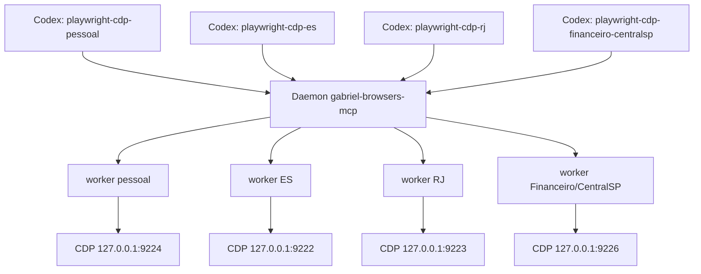

# Plano Técnico - Gateway MCP/CDP com Workers Recriáveis

**Status:** Aguardando aprovação  
**Data:** 2026-06-25  
**HTML visual:** [plano-gateway-mcp-cdp-2026-06-25.html](./plano-gateway-mcp-cdp-2026-06-25.html)

> Este Markdown é a fonte da verdade para execução. O HTML é apenas o painel visual de aprovação.

## 1. Entendimento

**Tarefa:** planejar uma reestruturação dos MCPs Playwright-CDP usados pelo Codex para reduzir consumo de RAM sem quebrar o acesso dos modelos aos navegadores Helium/CDP. O problema atual é que matar processos `playwright-mcp` libera memória, mas fecha o transporte que a thread do Codex conhece, gerando `Transport closed`.

**Escopo:** configuração global do Codex em `~/.codex/config.toml`, criação de um gateway MCP HTTP local, ciclo de vida de workers Playwright/CDP por perfil, atualização gradual das skills pessoais, e ajuste do app Swift `Custom CDP Browser` para não matar workers fora do protocolo do gateway.

**Premissas:**

- O Codex registra ferramentas MCP no início da sessão; matar o servidor MCP visto pelo Codex não é recuperável de forma confiável na mesma thread.
- Um MCP HTTP precisa estar vivo antes de iniciar a sessão para as ferramentas aparecerem.
- O processo pai do gateway deve ser leve e persistente; os processos pesados devem ser workers descartáveis por perfil.
- A primeira migração deve preservar os namespaces antigos (`mcp__playwright_cdp_pessoal__*`, etc.) para não quebrar skills existentes.
- O gateway deve usar `127.0.0.1`, não `localhost`, para evitar resolução IPv6 `::1` em portas CDP.

## 2. Exploração

**Arquivos analisados:**

| Arquivo | Por que importa |
|---------|-----------------|
| `AGENTS.md` | Define validação obrigatória (`swift build`, `swift test`) e prioridade de robustez para perfis CDP reais. |
| `~/.codex/config.toml` | Contém os quatro MCPs atuais `playwright-cdp-*` usando `@playwright/mcp@latest` via stdio. |
| `/Users/gabrielalonso/.agents/skills/chrome-open/SKILL.md` | Define o fluxo atual do perfil pessoal, proibições, ferramentas esperadas e troubleshooting de `localhost`/IPv6. |
| `Sources/CustomCDPBrowser/CDPProfile.swift` | Define os perfis canônicos, portas CDP e diretórios persistentes. |
| `Sources/CustomCDPBrowser/CDPProfileLauncher.swift` | Abre perfis, limpa locks, detecta/mata processos MCP e executa auto-limpeza. É o ponto perigoso para `Transport closed`. |
| `Sources/CustomCDPBrowser/SettingsView.swift` | Expõe o toggle e botão de limpeza MCP na UI. |
| `Sources/CustomCDPBrowser/ProfilePickerView.swift` | Botão por perfil chama desconexão de MCPs e mostra memória. |
| `Tests/CustomCDPBrowserTests/CustomCDPBrowserTests.swift` | Já cobre parsing/filtro de processos MCP, memória e detecção de ociosidade. |
| `README.md` | Documenta perfis, portas e comportamento atual de disconnect/auto-clean. |
| Manual atual do Codex | Confirma suporte a MCP stdio e HTTP, `enabled`, `bearer_token_env_var`, `startup_timeout_sec`, `tool_timeout_sec`. |
| Documentação oficial Playwright MCP | Confirma `--cdp-endpoint`, modo HTTP com `--port`, configuração por `cdpEndpoint` e conexão com Chromium via CDP. |

**Stack identificada:** SwiftUI/macOS no app `Custom CDP Browser`; Codex MCP via `~/.codex/config.toml`; Playwright MCP Node; proposta de gateway em Node/TypeScript com MCP HTTP e workers child process.

**Comandos de validação do projeto:**

- `swift build`
- `swift test`
- `scripts/build-app.sh` e `open .build/app/Custom-CDP-Browser.app` apenas se a implementação tocar bundle metadata, URL handlers ou default-browser behavior.
- Para o gateway planejado: `npm test`, `npm run typecheck`, testes de integração MCP/CDP e validação manual com `curl`/Codex.

## 3. Impacto Técnico

**Afeta contratos entre módulos?** Sim.

| Área | Arquivo/módulo | Mudança necessária | Contrato afetado |
|------|----------------|-------------------|------------------|
| Codex config | `~/.codex/config.toml` | Backup, criação de gateway canário, troca gradual dos quatro MCPs stdio por aliases HTTP e futura entrada única `gabriel-browsers`. | Sim |
| Gateway MCP | `/Volumes/SSD1TB/DotFiles/codex/gabriel-browsers-mcp/` | Novo daemon HTTP local, schemas estáticos/cacheados, autenticação, leases, workers por perfil, health/admin endpoints. | Sim |
| LaunchAgent | `~/Library/LaunchAgents/com.gabrielalonso.gabriel-browsers-mcp.plist` | Garantir daemon vivo antes de novas sessões Codex. | Sim |
| Skills | `/Users/gabrielalonso/.agents/skills/chrome-open/SKILL.md` e equivalentes | Fase 1: manter compatibilidade. Fase 2: migrar para `mcp__gabriel_browsers__*` com `profile`. | Sim |
| App Swift | `CDPProfileLauncher.swift`, `SettingsView.swift`, `ProfilePickerView.swift` | Remover dependência de kill direto como mecanismo de RAM; chamar gateway para `/workers` e `/release` ou desativar limpeza direta quando gateway estiver ativo. | Sim |
| Perfil registry | `CDPProfile.swift` + config do gateway | Evitar drift entre portas/diretórios do app, gateway e skills. | Sim |
| Documentação | `README.md`, skill docs | Documentar novo fluxo, rollback, limites e troubleshooting. | Não para API, mas sim para operação. |

**Ordem recomendada:** gateway e LaunchAgent primeiro; canary no Codex sem mexer nos MCPs antigos; aliases HTTP mantendo nomes antigos; integração do app; migração final das skills para namespace único.

### Decisão Arquitetural

A rota recomendada é **um daemon HTTP local único**, mas com **fase de compatibilidade mantendo quatro nomes MCP antigos**:



Isso entrega economia real de RAM sem obrigar uma troca simultânea de todas as skills. Depois, uma segunda fase pode consolidar o toolset em:

```text
mcp__gabriel_browsers__browser_tabs(profile: "pessoal")
```

## 4. Testes

### Testes existentes relevantes

| Arquivo | O que cobre | Relevância |
|---------|-------------|------------|
| `Tests/CustomCDPBrowserTests/CustomCDPBrowserTests.swift` | Filtros de comandos `playwright-mcp`, memória residente, processos idle, portas, parsing de `ps`/`lsof`. | Base para ajustar o app quando o gateway substituir kill direto. |
| `Tests/CustomCDPBrowserTests/CustomCDPBrowserTests.swift` | Perfis visíveis, aliases legados, default profile e portas. | Ajuda a detectar drift entre `CDPProfile.swift` e gateway. |

### Testes que devem ser ajustados

| Arquivo | Motivo | Ação |
|---------|--------|------|
| `Tests/CustomCDPBrowserTests/CustomCDPBrowserTests.swift` | O app não deve mais presumir que todo processo `@playwright/mcp` pode ser morto diretamente quando gateway estiver ativo. | Ajustar testes de limpeza para diferenciar modo legado vs gateway. |
| `Tests/CustomCDPBrowserTests/CustomCDPBrowserTests.swift` | Se o app chamar endpoints admin do gateway, novos testes precisam cobrir payloads e falhas. | Adicionar testes para cliente HTTP do gateway usando mocks. |

### Novos testes necessários

| Módulo | Arquivo | O que testar | Tipo | Justificativa |
|--------|---------|--------------|------|---------------|
| Gateway | `gateway/src/profileRegistry.test.ts` | Perfis, portas, diretórios e normalização para `127.0.0.1`. | Unit | Evita abrir perfil errado. |
| Gateway | `gateway/src/toolSchema.test.ts` | `tools/list` usa schemas estáticos/cacheados e não spawna worker. | Unit | Sem isso, a economia de RAM evapora no discovery. |
| Gateway | `gateway/src/workerManager.test.ts` | Spawn sob demanda, reuse, kill idle, restart após crash. | Unit | Coração da solução. |
| Gateway | `gateway/src/sessionLease.test.ts` | Leases por sessão/profile, mutex e chamadas em voo. | Unit | Evita uma thread matar worker usado por outra. |
| Gateway | `gateway/src/auth.test.ts` | Bearer token, Host loopback e endpoints admin protegidos. | Unit/integration | Perfis logados são superfície sensível. |
| Gateway | `gateway/src/staleRefs.test.ts` | Snapshot, worker morto, ação com ref antigo retorna erro claro. | Integration | Evita clique cego depois de restart. |
| Gateway | `gateway/test/cdp.integration.ts` | Conectar em cada porta CDP e recriar worker após kill manual. | Integration | Valida o objetivo real. |
| Codex config | script de validação | Backup, proposta de diff, rollback, env token disponível no Codex. | Script/teste operacional | Evita perder config atual. |
| App Swift | `CustomCDPBrowserTests` | Cliente de gateway `/workers`/`/release`, fallback quando daemon fora. | Unit | UI não pode quebrar se gateway estiver desligado. |

### Edge cases

- Gateway HTTP desligado antes de abrir uma nova thread: ferramentas não aparecem. Mitigação: LaunchAgent obrigatório com `KeepAlive` e health check.
- `tools/list` cria worker pesado: mata o benefício de RAM. Mitigação: schemas estáticos/cacheados e teste específico.
- Várias threads usando o mesmo perfil: idle cleanup não pode matar worker com chamada em voo ou lease ativo.
- Worker morre entre `browser_snapshot` e `browser_click`: retornar erro pedindo novo snapshot; não tentar reaproveitar ref velho.
- Porta CDP fechada: gateway deve abrir Helium e aguardar `/json/version`.
- Porta ocupada por processo errado: erro explícito com diagnóstico e sem matar processo desconhecido automaticamente.
- `localhost` resolvendo para `::1`: normalizar para `127.0.0.1`.
- Token de autenticação indisponível no Codex App GUI: validar antes do switch e documentar fallback seguro.
- `browser_run_code_unsafe`/`browser_evaluate` expõem alto poder local: política de aprovação/allowlist precisa ser deliberada.
- Upload/file chooser: manter regra manual por padrão e não automatizar anexos sem pedido.

### O que não precisa de teste novo

- Não precisa revalidar LaunchServices/default-browser se a implementação não tocar bundle metadata, URL handlers ou default-browser behavior.
- Não precisa criar testes profundos para UI visual do app se a primeira etapa só desativar/ocultar cleanup direto em modo gateway.
- Não precisa reimplementar toda a suíte oficial do Playwright MCP; o gateway deve testar contrato próprio, proxy, restart e segurança.

## 5. I18N

**Novas strings necessárias?** Sim, se a implementação tocar a UI Swift ou skills.

O projeto não tem infraestrutura formal de i18n; as strings visíveis hoje são hardcoded em inglês e português. Como o usuário usa português e pediu atenção a acentuação, novas strings operacionais voltadas a ele devem ser em português correto quando fizer sentido.

| Chave/área | Texto base | Módulo | Arquivo | Ação |
|------------|------------|--------|---------|------|
| Settings MCP | `Gateway MCP ativo` | Swift UI | `SettingsView.swift` | Criar se houver status do gateway. |
| Settings MCP | `Liberar workers ociosos` | Swift UI | `SettingsView.swift` | Substituir "Clean Idle MCPs Now" se a UI migrar para gateway. |
| Feedback | `Workers liberados com segurança pelo gateway.` | Swift UI | `CDPProfileLauncher.swift`/cliente gateway | Criar. |
| Feedback erro | `Gateway MCP indisponível. Nenhum processo foi encerrado.` | Swift UI | cliente gateway | Criar. |
| Skills | Instruções com `profile="pessoal"` | Skills | `chrome-open/SKILL.md` e equivalentes | Atualizar mantendo acentuação. |

**Arquivos a atualizar:**

- `Sources/CustomCDPBrowser/SettingsView.swift`
- `Sources/CustomCDPBrowser/ProfilePickerView.swift`
- `Sources/CustomCDPBrowser/CDPProfileLauncher.swift` ou novo cliente gateway
- `/Users/gabrielalonso/.agents/skills/chrome-open/SKILL.md`
- Skills equivalentes para ES/RJ/Financeiro, se existirem
- `README.md`

**Strings hardcoded a evitar:**

- Mensagens que prometem "limpar MCP" quando na verdade só liberam workers.
- Frases dizendo que `curl /json/version` confirma MCP disponível; confirma apenas CDP.
- Instruções com `localhost` para endpoints CDP.

## 6. Riscos e Mitigação

| # | Risco | Probabilidade | Impacto | Mitigação |
|---|-------|---------------|---------|-----------|
| 1 | HTTP gateway fora do ar no startup da thread. | Média | Ferramentas não aparecem no Codex. | LaunchAgent obrigatório, `KeepAlive`, logs, health check e teste com gateway desligado/frio. |
| 2 | Discovery de tools spawna workers pesados. | Média | RAM continua alta em toda thread. | Schemas estáticos/cacheados, versão fixada do Playwright MCP e teste garantindo zero worker em `tools/list`. |
| 3 | Perda de namespaces antigos quebra skills. | Alta | Workflows atuais deixam de funcionar. | Fase 1 com quatro aliases HTTP mantendo nomes antigos; migrar skills só depois. |
| 4 | Uma thread mata worker usado por outra. | Média | Falhas intermitentes e perda de estado. | Leases por sessão/profile, mutex por perfil e idle cleanup só sem chamadas em voo. |
| 5 | Gateway local sem autenticação controla perfis logados. | Média | Qualquer processo local pode operar WhatsApp/contas abertas. | Bearer token/env header, bind em loopback, validação de Host, proteção de endpoints admin. |
| 6 | App Swift mata child process do gateway diretamente. | Alta se não mexer | Estado interno do gateway fica inconsistente. | Tornar integração com gateway parte obrigatória; no mínimo desativar cleanup direto quando gateway ativo. |
| 7 | Drift entre perfil no app, skill e gateway. | Média | Abre perfil/porta errada. | Registry explícito no gateway e teste de paridade contra `CDPProfile.visibleProfiles`. |
| 8 | Ref de snapshot fica obsoleto após restart. | Média | Clique/typing falha ou age no alvo errado. | Erro claro pedindo novo snapshot; teste específico. |
| 9 | Token não chega ao Codex App por ambiente GUI. | Média | MCP HTTP falha autenticação no app. | Validar antes do switch; documentar método de injeção via launchd/env ou fallback aprovado. |
| 10 | Rollback incompleto. | Baixa | Perda de configuração funcional. | Backup timestampado, diff proposto, não apagar entradas antigas e checklist de restauração. |

## 7. Plano de Implementação

### Wave 0: Segurança e Inventário

- [ ] Passo 0.1: Criar backup timestampado de `~/.codex/config.toml` em `~/.codex/backups/` -> Verificação: arquivo existe e `diff` contra config atual mostra cópia fiel.
- [ ] Passo 0.2: Gerar proposta de config em arquivo separado, sem aplicar ainda -> Verificação: proposta contém entradas novas e rollback documentado.
- [ ] Passo 0.3: Inventariar skills que mencionam `playwright-cdp-*` -> Verificação: lista de arquivos e prefixes produzida por `rg`.
- [ ] Passo 0.4: Registrar baseline de processos/RAM dos MCPs atuais -> Verificação: `ps`/`lsof` mostram runners e servidores atuais por porta.

### Wave 1: Gateway HTTP Mínimo, Seguro e Sempre Vivo

- [ ] Passo 1.1: Criar pacote Node/TypeScript `gabriel-browsers-mcp` em `/Volumes/SSD1TB/DotFiles/codex/gabriel-browsers-mcp/` -> Verificação: `npm test` e `npm run typecheck`.
- [ ] Passo 1.2: Implementar servidor MCP HTTP pai em `127.0.0.1:8787` com `/health` versionado -> Verificação: `curl -fsS http://127.0.0.1:8787/health`.
- [ ] Passo 1.3: Adicionar autenticação local por bearer token/env header e validação de Host -> Verificação: request sem token falha; request com token passa.
- [ ] Passo 1.4: Adicionar LaunchAgent com `KeepAlive`, logs e inicialização no login -> Verificação: `launchctl print gui/$UID/com.gabrielalonso.gabriel-browsers-mcp` e health check após restart do daemon.

### Wave 2: Schemas Estáticos e Workers Recriáveis

- [ ] Passo 2.1: Fixar versão do `@playwright/mcp` e gerar/cachear schemas oficiais de tools -> Verificação: `tools/list` retorna ferramentas sem criar processo worker.
- [ ] Passo 2.2: Implementar manager de workers por perfil, com spawn sob demanda e endpoint CDP normalizado para `127.0.0.1` -> Verificação: primeira chamada cria worker do perfil correto.
- [ ] Passo 2.3: Implementar idle timeout, kill seguro e restart no próximo call -> Verificação: worker desaparece após idle e renasce em nova chamada.
- [ ] Passo 2.4: Implementar leases por sessão/profile, mutex por profile e bloqueio de cleanup com chamada em voo -> Verificação: teste com duas sessões não mata worker ativo.
- [ ] Passo 2.5: Implementar abertura de Helium quando CDP estiver fechado, reaproveitando comandos/locks do app/skill -> Verificação: CDP fechado abre e responde `/json/version`.
- [ ] Passo 2.6: Implementar erro claro para refs/snapshots obsoletos após restart -> Verificação: teste snapshot -> kill worker -> click com ref antigo pede novo snapshot.

### Wave 3: Canário no Codex Sem Quebrar Legado

- [ ] Passo 3.1: Adicionar entrada canário `mcp_servers.gabriel-browsers-canary` ou `gabriel-browsers` em `~/.codex/config.toml`, mantendo os quatro MCPs antigos intactos -> Verificação: nova thread mostra tools canário sem remover antigas.
- [ ] Passo 3.2: Testar chamadas reais em cada perfil pelo canário -> Verificação: tabs/snapshot/evaluate funcionam em `pessoal`, `central-es`, `central-rj`, `financeiro-centralsp`.
- [ ] Passo 3.3: Matar worker manualmente durante sessão e chamar tool novamente -> Verificação: mesma thread recria worker sem `Transport closed`.
- [ ] Passo 3.4: Medir RAM antes/depois do idle timeout -> Verificação: RSS dos workers cai; daemon pai permanece baixo.

### Wave 4: Aliases HTTP com Namespaces Antigos

- [ ] Passo 4.1: Trocar as quatro seções antigas para HTTP aliases apontando para o gateway, preservando os nomes `playwright-cdp-*` -> Verificação: prefixes antigos continuam existindo em nova thread.
- [ ] Passo 4.2: Manter as definições antigas no backup e não apagar rollback -> Verificação: rollback restaura `command`/`args` stdio.
- [ ] Passo 4.3: Configurar `enabled_tools`/aprovação por ferramenta, incluindo navegação, evaluate, unsafe e upload -> Verificação: `/mcp` e config refletem política esperada.
- [ ] Passo 4.4: Rodar a skill `chrome-open` sem alterar ainda -> Verificação: ela continua usando `mcp__playwright_cdp_pessoal__*`, mas backend é gateway.

### Wave 5: Integração do App Swift

- [ ] Passo 5.1: Criar cliente leve para `/health`, `/workers` e `/release` do gateway ou modo de detecção do gateway ativo -> Verificação: testes com mock HTTP.
- [ ] Passo 5.2: Trocar botão/telemetria de cleanup para gateway quando disponível; manter fallback legado explícito quando não disponível -> Verificação: botão não mata PID diretamente em modo gateway.
- [ ] Passo 5.3: Atualizar textos visíveis com português correto e sem promessa enganosa -> Verificação: revisão visual da Settings/ProfilePicker.
- [ ] Passo 5.4: Rodar `swift build` e `swift test` -> Verificação: todos passam.

### Wave 6: Migração Final das Skills para Namespace Único

- [ ] Passo 6.1: Atualizar `chrome-open` para usar `mcp__gabriel_browsers__*` com `profile="pessoal"` -> Verificação: skill não pede mais nova thread com `playwright-cdp-pessoal.enabled=true`.
- [ ] Passo 6.2: Atualizar skills equivalentes de ES/RJ/Financeiro -> Verificação: `rg "playwright_cdp|playwright-cdp"` encontra apenas seção de rollback/docs legadas.
- [ ] Passo 6.3: Desabilitar aliases antigos apenas após skills validadas -> Verificação: nova thread expõe só o MCP único, se aprovado.
- [ ] Passo 6.4: Atualizar README e troubleshooting -> Verificação: docs explicam gateway, rollback, auth e idle workers.

## 8. Checklist de Validação

- [ ] Backup criado: `ls -l ~/.codex/backups/config.toml.*`
- [ ] Gateway typecheck: `npm run typecheck`
- [ ] Gateway testes unitários: `npm test`
- [ ] Gateway health: `curl -fsS http://127.0.0.1:8787/health`
- [ ] LaunchAgent ativo: `launchctl print gui/$UID/com.gabrielalonso.gabriel-browsers-mcp`
- [ ] `tools/list` não spawna worker pesado.
- [ ] Matar worker não remove tools da thread e próxima chamada recria.
- [ ] RAM cai após idle timeout; daemon pai permanece vivo.
- [ ] Perfis CDP respondem em `127.0.0.1:9224`, `9222`, `9223`, `9226`.
- [ ] Config Codex preserva `openaiDeveloperDocs` e `node_repl`.
- [ ] Policies de aprovação/allowlist revisadas para tools perigosas.
- [ ] Skills atualizadas somente depois da fase alias passar.
- [ ] Build do app Swift: `swift build`
- [ ] Testes Swift: `swift test`
- [ ] Confirmar que I18N/textos visíveis foram atualizados, quando aplicável.
- [ ] Confirmar critérios de aceite do HTML visual.

## 9. Revisão Crítica

**Resultado do advogado do diabo:** gaps críticos/altos encontrados e incorporados.

| Severidade | Gap encontrado | Evidência | Ajuste aplicado |
|------------|----------------|-----------|-----------------|
| CRÍTICO | Um único server `gabriel-browsers` não preserva namespaces antigos. | `~/.codex/config.toml:64`; `chrome-open/SKILL.md:18` | Plano agora exige Fase 1 com quatro aliases HTTP mantendo nomes antigos; namespace único só depois. |
| CRÍTICO | `tools/list` pode spawnar Playwright se schemas não forem estáticos. | `chrome-open/SKILL.md:171` | Plano exige versão fixada, schema cacheado e teste garantindo discovery sem worker. |
| ALTO | Falta modelo de sessão/lease para múltiplas threads. | `CDPProfileLauncher.swift:35` trata processos separados; MCP stdio atual é por sessão. | Adicionados leases por sessão/profile, mutex e cleanup sem chamadas em voo. |
| ALTO | HTTP gateway sem token controla perfis logados. | Config HTTP proposta em loopback. | Adicionados bearer token/env header, Host validation e proteção de admin endpoints. |
| ALTO | App atual mata PIDs diretamente e poderia quebrar estado do gateway. | `ProfilePickerView.swift:288`; `CDPProfileLauncher.swift:484` | Integração do app deixou de ser opcional; cleanup direto deve ser substituído ou explicitamente fallback legado. |
| ALTO | HTTP MCP não é iniciado pelo Codex. | MCP HTTP usa `url`; stdio usa `command`. | LaunchAgent virou parte obrigatória da migração. |
| MÉDIO | ES/RJ usam `localhost`, com risco IPv6. | `~/.codex/config.toml:68` | Gateway deve normalizar tudo para `127.0.0.1` e testar ES/RJ. |
| MÉDIO | Drift entre Swift, gateway e skills. | `CDPProfile.swift:69`; `chrome-open/SKILL.md:24` | Adicionado registry explícito e teste de paridade. |
| MÉDIO | Refs/snapshots obsoletos após restart. | Fluxo de snapshot/click da skill. | Adicionado erro claro e teste específico. |
| MÉDIO | Aprovações por ferramenta podem se perder. | `~/.codex/config.toml:80` | Adicionada etapa obrigatória de approval/allowlist. |

## 10. Critérios de Aprovação Humana

- O Codex consegue abrir nova thread com ferramentas MCP disponíveis sem subir quatro processos Playwright pesados no startup.
- Ao matar um worker idle, a thread não perde ferramentas; a próxima chamada recria o worker.
- A RAM cai após idle timeout sem gerar `Transport closed`.
- Os perfis Pessoal, ES, RJ e Financeiro/CentralSP continuam acessíveis e não trocam de porta/perfil.
- Existe rollback simples para a configuração atual.
- O app não mata workers do gateway fora do protocolo.

## Config Codex Planejada

### Backup

```bash
mkdir -p ~/.codex/backups
cp -p ~/.codex/config.toml ~/.codex/backups/config.toml.$(date +%Y%m%d-%H%M%S)
```

### Fase Canário

```toml
[mcp_servers.gabriel-browsers]
url = "http://127.0.0.1:8787/mcp"
enabled = true
startup_timeout_sec = 5
tool_timeout_sec = 120
bearer_token_env_var = "GABRIEL_BROWSERS_MCP_TOKEN"
```

### Fase Alias Compatível

```toml
[mcp_servers.playwright-cdp-pessoal]
url = "http://127.0.0.1:8787/pessoal/mcp"
enabled = true
startup_timeout_sec = 5
tool_timeout_sec = 120
bearer_token_env_var = "GABRIEL_BROWSERS_MCP_TOKEN"

[mcp_servers.playwright-cdp-es]
url = "http://127.0.0.1:8787/central-es/mcp"
enabled = true
startup_timeout_sec = 5
tool_timeout_sec = 120
bearer_token_env_var = "GABRIEL_BROWSERS_MCP_TOKEN"

[mcp_servers.playwright-cdp-rj]
url = "http://127.0.0.1:8787/central-rj/mcp"
enabled = true
startup_timeout_sec = 5
tool_timeout_sec = 120
bearer_token_env_var = "GABRIEL_BROWSERS_MCP_TOKEN"

[mcp_servers.playwright-cdp-financeiro-centralsp]
url = "http://127.0.0.1:8787/financeiro-centralsp/mcp"
enabled = true
startup_timeout_sec = 5
tool_timeout_sec = 120
bearer_token_env_var = "GABRIEL_BROWSERS_MCP_TOKEN"
```

As entradas antigas com `command` e `args` devem permanecer recuperáveis pelo backup, não misturadas com `url` na mesma fase aplicada.

## Status

Nada deve ser implementado até aprovação explícita.
