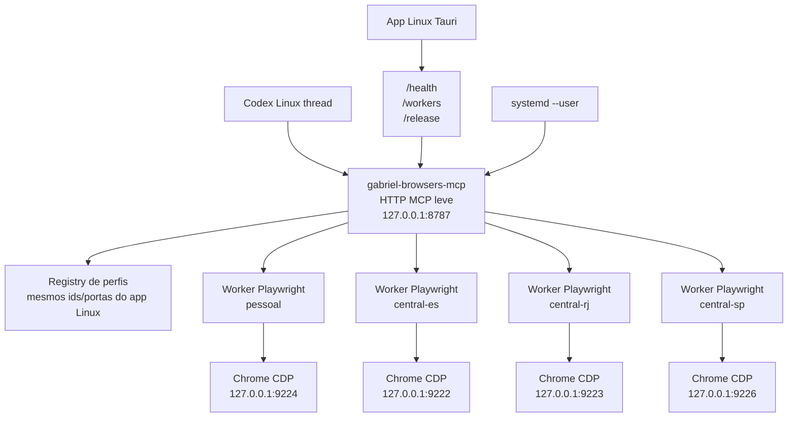
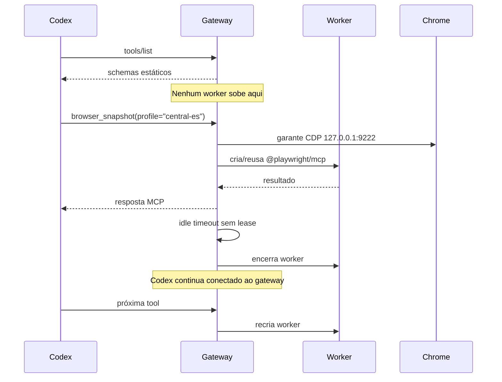

# Plano Técnico - Gateway MCP/CDP no Linux

**Status:** Aprovado; implementação iniciada  
**Data:** 2026-07-06  
**Base arquitetural:** implementação macOS descrita em `planning/plano-gateway-mcp-cdp-2026-06-25.md`

## 1. Entendimento

**Tarefa:** implementar no Linux a mesma lógica do Gateway MCP/CDP usada no macOS: o Codex fala com um MCP HTTP leve e persistente, enquanto os processos pesados `@playwright/mcp` viram workers descartáveis por perfil.

**Decisão:** portar o contrato do macOS, não inventar outro desenho. A diferença entre macOS e Linux deve ficar só na inicialização do daemon, descoberta do browser e integração com a UI.

O problema continua o mesmo: matar um `playwright-mcp` visto diretamente pela thread do Codex libera RAM, mas quebra o transporte MCP e gera `Transport closed`. O gateway resolve isso porque o Codex nunca perde o servidor MCP principal.

## 2. Arquitetura-Alvo



| Peça | Linux | Regra |
|---|---|---|
| Gateway MCP | `gateway/gabriel-browsers-mcp` | Processo pai leve, sempre vivo, sem Playwright no startup. |
| Supervisor | `systemd --user` | Equivalente Linux do `LaunchAgent`. |
| Endpoint | `http://127.0.0.1:8787` | Igual ao macOS; não usar `localhost`. |
| Auth | `GABRIEL_BROWSERS_MCP_TOKEN` | Mesmo arquivo: `~/.codex/gabriel-browsers-mcp.env`. |
| App Linux | Tauri/Rust | Cliente administrativo; não gerencia worker diretamente. |
| Workers | `@playwright/mcp` | Sobem sob demanda e morrem por idle/release. |
| Sessão gráfica | `DISPLAY`/`WAYLAND_DISPLAY`/D-Bus | Obrigatório se o gateway abrir Chrome quando CDP estiver fechado. |

## 3. Contrato HTTP/MCP

Manter os mesmos paths do macOS. Isso reduz drift mental, bugs idiotas e documentação duplicada.

| Path | Público | Função |
|---|---:|---|
| `/health` | Sim | Health check do processo pai. Não exige token. |
| `/mcp` | Não | MCP unificado `gabriel-browsers`, com argumento `profile`. |
| `/pessoal/mcp` | Não | Alias compatível para `playwright-cdp-pessoal`. |
| `/central-es/mcp` | Não | Alias compatível para `playwright-cdp-es`. |
| `/central-rj/mcp` | Não | Alias compatível para `playwright-cdp-rj`. |
| `/financeiro-centralsp/mcp` | Não | Alias compatível para `playwright-cdp-financeiro-centralsp`. |
| `/workers` | Não | Status dos workers, RSS estimado, perfil, idle, PID. |
| `/release` | Não | Libera worker de um perfil sem fechar Chrome/CDP. |

Resposta esperada de `/release`:

```json
{
  "profile": "central-es",
  "released": true
}
```

## 4. Registry de Perfis

A fonte de verdade no Linux hoje está em `apps/linux/crates/cdp-core/src/config.rs`. O gateway deve ler a mesma configuração ou usar uma biblioteca compartilhada; duplicar perfil na mão é pedir para abrir conta errada.

| Perfil | ID no app Linux | Alias MCP compatível | Porta |
|---|---|---|---:|
| Pessoal | `pessoal` | `playwright-cdp-pessoal` | 9224 |
| Central ES | `central-es` | `playwright-cdp-es` | 9222 |
| Central RJ | `central-rj` | `playwright-cdp-rj` | 9223 |
| Financeiro/CentralSP | `central-sp` | `playwright-cdp-financeiro-centralsp` | 9226 |

**Decisão:** preservar o path legado `/financeiro-centralsp/mcp`, mesmo que o ID Linux seja `central-sp`. Compatibilidade ganha aqui.

## 5. Ciclo de Vida



Regras:

- `tools/list` nunca pode criar worker.
- Uma chamada em voo segura um lease do perfil.
- Cleanup só pode matar worker sem lease ativo.
- Se um worker morrer entre snapshot e click, a próxima ação deve pedir novo snapshot com erro claro.
- Porta CDP ocupada por processo errado é erro, não convite para sair matando PID.

## 6. Segurança

Esse gateway controla perfis logados. Tratar como brinquedo seria burrice com boa iluminação.

| Risco | Defesa obrigatória |
|---|---|
| Processo local aleatório chamando tools | Bearer token em todos os endpoints MCP/admin. |
| Resolução IPv6 ou host estranho | Bind em `127.0.0.1` e validação de `Host`. |
| Tool perigosa rodando sem freio | `browser_evaluate` com aprovação; `browser_run_code_unsafe` desativado. |
| Token ausente no Codex GUI | Validação antes de trocar config; rollback pronto. |
| Upload/anexos automáticos | Manter prompt/approval explícito. |

## 7. systemd --user

Equivalente Linux do LaunchAgent macOS:

```ini
[Unit]
Description=Gabriel Browsers MCP Gateway
After=network.target

[Service]
Type=simple
EnvironmentFile=%h/.codex/gabriel-browsers-mcp.env
WorkingDirectory=%h/Projetos/Browser-CDP-Custom/gateway/gabriel-browsers-mcp
ExecStart=/usr/bin/env npm start
Restart=always
RestartSec=2

[Install]
WantedBy=default.target
```

Comandos operacionais:

```bash
systemctl --user daemon-reload
systemctl --user import-environment DISPLAY WAYLAND_DISPLAY XAUTHORITY DBUS_SESSION_BUS_ADDRESS XDG_CURRENT_DESKTOP XDG_SESSION_TYPE
dbus-update-activation-environment --systemd DISPLAY WAYLAND_DISPLAY XAUTHORITY DBUS_SESSION_BUS_ADDRESS XDG_CURRENT_DESKTOP XDG_SESSION_TYPE
systemctl --user enable --now gabriel-browsers-mcp.service
systemctl --user status gabriel-browsers-mcp.service
curl -fsS http://127.0.0.1:8787/health
```

**Regra prática:** não habilitar `linger` como padrão. Para este caso, o gateway deve viver junto da sessão gráfica, porque abrir Chrome sem sessão gráfica é uma ótima forma de perder uma tarde olhando log inútil.

## 8. Config Codex Planejada

Fase canário:

```toml
[mcp_servers.gabriel-browsers]
url = "http://127.0.0.1:8787/mcp"
enabled = true
startup_timeout_sec = 5
tool_timeout_sec = 120
bearer_token_env_var = "GABRIEL_BROWSERS_MCP_TOKEN"
disabled_tools = ["browser_run_code_unsafe"]
```

Fase compatível:

```toml
[mcp_servers.playwright-cdp-pessoal]
url = "http://127.0.0.1:8787/pessoal/mcp"
enabled = true
startup_timeout_sec = 5
tool_timeout_sec = 120
bearer_token_env_var = "GABRIEL_BROWSERS_MCP_TOKEN"
disabled_tools = ["browser_run_code_unsafe"]

[mcp_servers.playwright-cdp-es]
url = "http://127.0.0.1:8787/central-es/mcp"
enabled = true
startup_timeout_sec = 5
tool_timeout_sec = 120
bearer_token_env_var = "GABRIEL_BROWSERS_MCP_TOKEN"
disabled_tools = ["browser_run_code_unsafe"]

[mcp_servers.playwright-cdp-rj]
url = "http://127.0.0.1:8787/central-rj/mcp"
enabled = true
startup_timeout_sec = 5
tool_timeout_sec = 120
bearer_token_env_var = "GABRIEL_BROWSERS_MCP_TOKEN"
disabled_tools = ["browser_run_code_unsafe"]

[mcp_servers.playwright-cdp-financeiro-centralsp]
url = "http://127.0.0.1:8787/financeiro-centralsp/mcp"
enabled = true
startup_timeout_sec = 5
tool_timeout_sec = 120
bearer_token_env_var = "GABRIEL_BROWSERS_MCP_TOKEN"
disabled_tools = ["browser_run_code_unsafe"]
```

## 9. Plano de Implementação

### Wave 0: Inventário e Segurança

- [ ] Criar backup de `~/.codex/config.toml`.
- [ ] Criar/validar `~/.codex/gabriel-browsers-mcp.env`.
- [ ] Medir baseline de RAM dos MCPs atuais.
- [ ] Confirmar perfis reais em `~/.chrome-cdp/*`.
- [ ] Confirmar que `127.0.0.1:8787` está livre.
- [ ] Confirmar variáveis gráficas disponíveis para `systemd --user`.

### Wave 1: Gateway HTTP Pai

- [ ] Criar pacote `gateway/gabriel-browsers-mcp`.
- [ ] Implementar `/health`.
- [ ] Implementar autenticação Bearer e validação de loopback.
- [ ] Criar systemd user service.
- [ ] Validar restart automático.
- [ ] Validar que o daemon consegue abrir Chrome a partir do systemd user service.

### Wave 2: Schemas Estáticos

- [ ] Fixar versão do `@playwright/mcp`.
- [ ] Gerar/cachear schemas oficiais.
- [ ] Implementar `tools/list` sem spawn de worker.
- [ ] Testar que discovery mantém RSS baixo.

### Wave 3: Worker Manager

- [ ] Implementar spawn por perfil.
- [ ] Garantir CDP antes de chamar worker, reaproveitando a lógica do `cdp-core`.
- [ ] Implementar reuse, idle timeout e restart após crash.
- [ ] Implementar leases por sessão/perfil.
- [ ] Implementar erro claro para refs obsoletos.

### Wave 4: Canário no Codex

- [ ] Adicionar `gabriel-browsers` ao `~/.codex/config.toml`.
- [ ] Abrir nova thread e validar tools sem workers pesados no startup.
- [ ] Testar cada perfil.
- [ ] Matar worker manualmente e validar recriação na mesma thread.

### Wave 5: Aliases Compatíveis

- [ ] Trocar entradas `playwright-cdp-*` para HTTP aliases.
- [ ] Preservar rollback stdio no backup.
- [ ] Validar skills antigas sem edição.
- [ ] Revisar approval mode de `browser_evaluate` e upload.

### Wave 6: Integração Tauri/Rust

- [ ] Adicionar cliente HTTP do gateway no `cdp-core` ou crate novo.
- [ ] Expor comandos Tauri para `/health`, `/workers`, `/release`.
- [ ] Mostrar status real de MCP RAM no footer.
- [ ] Adicionar botão de release por perfil.
- [ ] Manter fallback legado só se o gateway estiver ausente e com texto explícito.

### Wave 7: Migração Final

- [ ] Migrar skills para `mcp__gabriel_browsers__*` com `profile`.
- [ ] Desabilitar aliases antigos só depois de validação real.
- [ ] Atualizar README Linux e troubleshooting.
- [ ] Documentar rollback.

## 10. Testes

| Camada | Comando/Teste | Critério |
|---|---|---|
| Gateway | `npm test` | Worker manager, auth, registry, leases. |
| Gateway | `npm run typecheck` | Tipos sem erro. |
| Gateway | teste `tools/list` | Zero worker criado. |
| Gateway | integração CDP | Cada perfil abre e responde `/json/version`. |
| systemd | abrir Chrome pelo daemon | Serviço herda sessão gráfica corretamente. |
| Linux core | `cargo test -p browser-cdp-core` | Regressões do launcher/router. |
| Frontend | `npm run check` | Svelte sem erro. |
| Build web | `npm run build` | Bundle OK. |
| Check completo | `apps/linux/scripts/check.sh` | Suite Linux local. |
| Tauri | `REQUIRE_TAURI=1 apps/linux/scripts/check.sh` | Quando deps nativas existirem. |

Novos testes mínimos:

- `profileRegistry.test.ts`: IDs, aliases e portas.
- `toolSchema.test.ts`: discovery sem spawn.
- `workerManager.test.ts`: spawn, reuse, idle, crash/restart.
- `sessionLease.test.ts`: duas threads não se atropelam.
- `auth.test.ts`: token obrigatório fora de `/health`.
- `staleRefs.test.ts`: snapshot antigo após restart falha com mensagem útil.
- Teste Rust do cliente gateway: token por env/arquivo, `/release` e erro HTTP.

## 11. Critérios de Aceite

- Nova thread Codex vê tools MCP com o gateway vivo.
- Nenhum worker Playwright sobe no startup/discovery.
- Primeira chamada em um perfil cria apenas o worker daquele perfil.
- Worker idle morre e a próxima tool recria sem `Transport closed`.
- Gateway iniciado pelo `systemd --user` consegue abrir Chrome em sessão gráfica real.
- Perfis Linux mantêm as portas `9224`, `9222`, `9223`, `9226`.
- App Tauri mostra status real e libera worker via `/release`.
- Rollback para stdio antigo é simples e documentado.

## 12. Veredito

O plano certo no Linux é uma cópia fiel do contrato macOS com troca de supervisor: `LaunchAgent` sai, `systemd --user` entra. O resto deve ser igual de propósito. Diferença demais aqui só criaria bug com sotaque.

Implementação aprovada em 2026-07-06.
